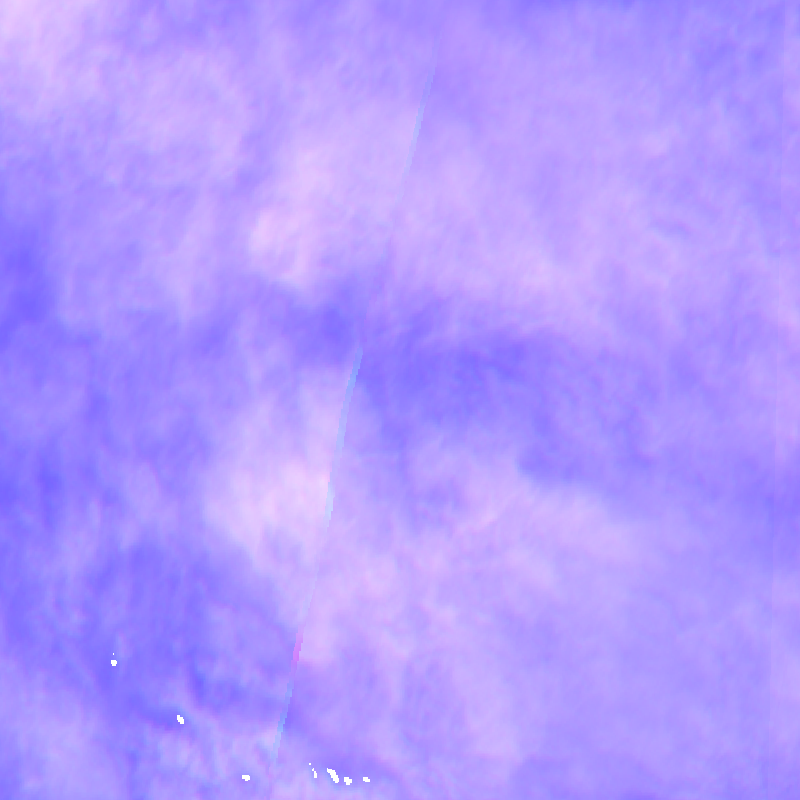
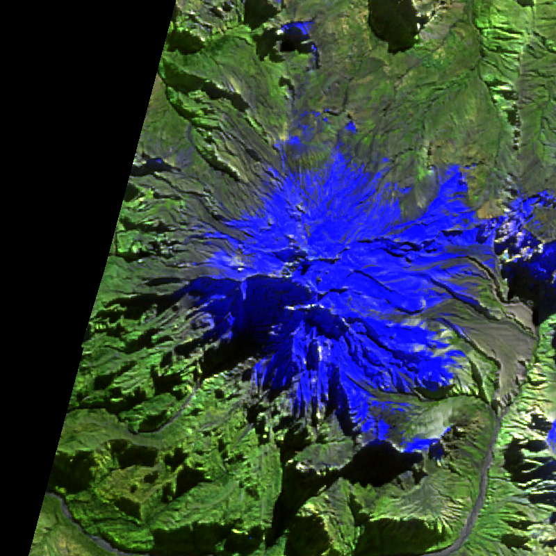

# 🟡 ALERTA MODERADA: Nevado de Longavi

## 📊 Resumen

**Volcán:** Nevado de Longavi  
**Nivel:** ALERTA_MODERADA  
**Fecha detección:** 2026-05-15 21:59 UTC  
**Tipo de cambio:** ANOMALÍA TÉRMICA FUERTE

---

## 🛰️ Detección Sentinel-2

- **Porcentaje de cambio:** 99.94%
- **Fecha nueva:** 2026-05-14
- **Fecha comparación:** 2026-05-04
- **Tipo de imagen:** ThermalFalseColor

### 📸 Imágenes

**Antes (2026-05-04):**

**Después (2026-05-14):**

---
## 🌍 NASA FIRMS

⚪ Sin anomalías térmicas detectadas en últimos 7 días (FIRMS)

> 📝 Nota: El cambio detectado por Sentinel-2 podría ser morfológico (sin emisión térmica) o FIRMS podría no haber capturado el evento.

---
## ⚠️ Acciones Recomendadas

1. Revisar imágenes en dashboard: https://MendozaVolcanic.github.io/Copernicus-v1/
2. Monitorear en próximas adquisiciones
3. Considerar generar PPT comparativo si el cambio persiste

---

*Alerta generada automáticamente por Copernicus-v1 Sistema de Detección de Cambios*  
*Powered by Sentinel-2 L2A + NASA FIRMS VIIRS*
